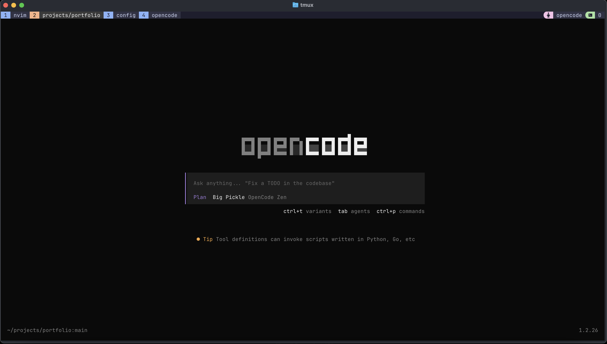
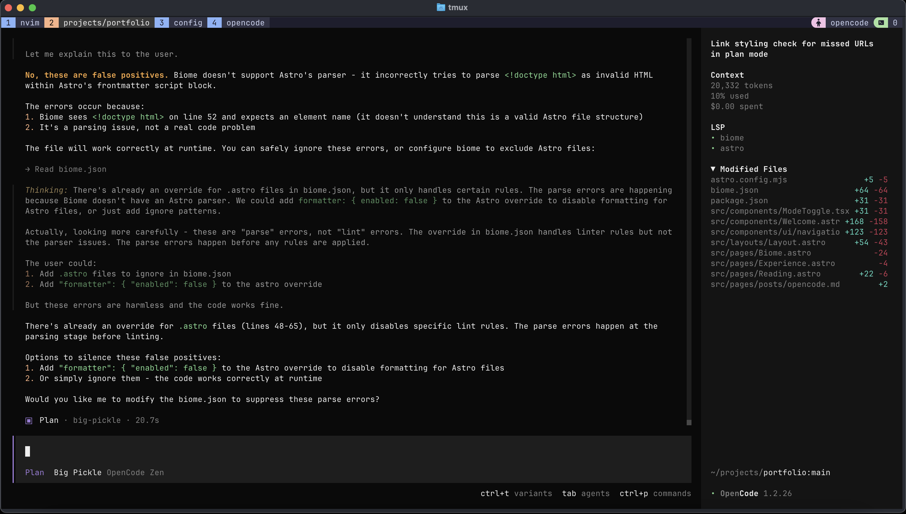

OpenCode AI

OpenCode is an opensource terminal-fouced harness for LLMs akin to [Claude Code](https://code.claude.com/docs/en/overview). The key difference being that OpenCode is entirely [opensource](https://github.com/anomalyco/opencode). Another key distinction is that you are not tied to only anthropic models. OpenCode also has a rotating offering of free models you can use at any given time.

While my choice of AI tooling is still very much in flux due to the rapid change amongst the harnesses and the LLMs themselves, I've found OpenCode to be a nice home base for the time being. Since it allows the use of multiple models at a time, it gives room for experimentation. Besides that, it's nice to see an opensource alternative compared to the products of the ultra vc-funded companies and those backed by huge players like Microsoft.

I'm keeping an eye on the likes of Claude Code and Codex, and I'm already using cursor for work. It'll be interesting to see which of these four will emerge with the lion's share of the market.
